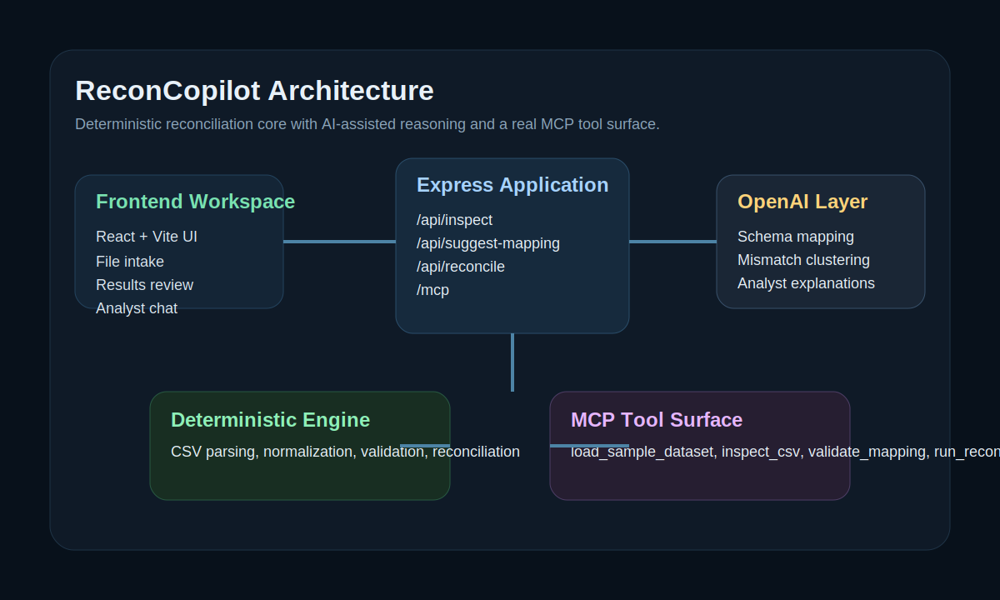
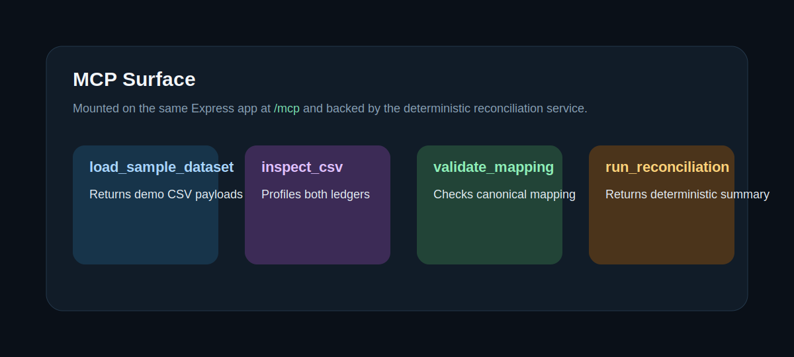
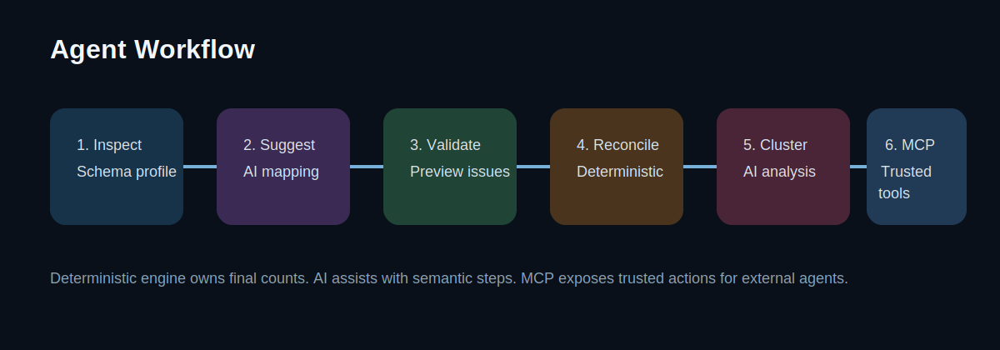

# ReconCopilot: Agentic Reconciliation Workspace

ReconCopilot is an AI-assisted workspace for finance operations teams that reconcile internal ledgers against partner settlement files. It combines deterministic reconciliation logic with explicit AI-assisted steps for schema mapping, mismatch clustering, and audit-friendly explanations.



## Why this project matters

Manual reconciliation is slow, repetitive, and risky when data arrives from multiple payment partners with inconsistent schemas. ReconCopilot reduces that friction for:

- Finance controllers reconciling daily transaction batches
- Payment operations teams reviewing settlement discrepancies
- Audit and support teams triaging mismatch clusters quickly

The product is intentionally **not just a chatbot**. The business-critical comparison logic remains deterministic, while AI is used only where probabilistic help adds value.

## What makes it an AI agent project

ReconCopilot executes an explicit multi-step workflow:

1. Inspect two uploaded CSVs and profile their schemas
2. Ask OpenAI to suggest canonical field mappings with structured output
3. Validate the mapping before execution
4. Run deterministic reconciliation
5. Ask OpenAI to cluster mismatches and explain likely causes
6. Expose the trusted reconciliation actions through a real MCP server

## Deterministic vs AI vs MCP

| Layer | Responsibility | Why it belongs there |
| --- | --- | --- |
| Deterministic engine | CSV parsing, field validation, amount normalization, status normalization, reconciliation summary | Correctness and repeatability matter |
| AI assistance | Mapping suggestions, mismatch clustering, analyst explanations | These steps benefit from semantic reasoning |
| MCP tools | Standardized access to trusted business actions | Demonstrates explicit tool use and protocol-based integration |

## Real MCP usage

This repository now exposes a real MCP endpoint at `/mcp` with four tools:

- `load_sample_dataset`
- `inspect_csv`
- `validate_mapping`
- `run_reconciliation`

The MCP layer wraps the same deterministic reconciliation engine used by the web app. A smoke test client is included in [`scripts/mcp-smoke.ts`](scripts/mcp-smoke.ts).



## Architecture



High-level components:

- React frontend for file intake, review workflow, results, and analyst chat
- Express server for HTTP APIs and MCP endpoint
- Deterministic reconciliation engine in TypeScript
- OpenAI Responses API integration for schema mapping, mismatch analysis, and contextual chat
- Sample datasets and tests for reproducible local evaluation

More detail:

- [`docs/architecture.md`](docs/architecture.md)
- [`docs/agent-workflow.md`](docs/agent-workflow.md)
- [`docs/evaluation.md`](docs/evaluation.md)

## Repository structure

```text
src/
  App.tsx                     Frontend workspace
  reconciliation_engine.ts    Deterministic business logic
  reconciliation_service.ts   Shared service layer for APIs and MCP
  mcp.ts                      MCP tool registration
  sampleData.ts               Built-in demo dataset
server.ts                     Express server + MCP mount
tests/                        Deterministic engine tests
scripts/mcp-smoke.ts          MCP smoke-test client
sample-data/                  CSV files for demo and docs
docs/                         Submission-oriented documentation
```

## Quick start

### Prerequisites

- Node.js 20+
- An OpenAI API key

### Local setup

```bash
npm install
cp .env.example .env.local
```

Set `OPENAI_API_KEY` in `.env.local`, then run:

```bash
npm run dev
```

Open `http://localhost:8080`.

### Useful commands

```bash
npm run lint
npm run test
npm run build
npm run mcp:smoke
npm run openai:flow-smoke
```

## CI

GitHub Actions now includes two workflows:

- `Backend CI`: runs install, typecheck, tests, build, and MCP smoke validation
- `AI Eval CI`: runs the OpenAI-backed end-to-end smoke flow when `OPENAI_API_KEY` is configured in repository secrets

For the AI eval workflow, add `OPENAI_API_KEY` in GitHub repository secrets before relying on the job as a required check.

### Demo stability note

This repo was migrated from Gemini to OpenAI after repeated demo-time `429` and availability spikes on the old provider path. The current flow reduces request pressure by:

- keeping reconciliation deterministic
- making mismatch clustering on demand instead of automatic
- caching repeated AI requests server-side
- sending a smaller context payload to the chat step

## Reproducible demo flow

Use the built-in sample dataset or the files in [`sample-data/`](sample-data/):

- [`sample-data/internal_ledger_payos.csv`](sample-data/internal_ledger_payos.csv)
- [`sample-data/partner_settlement_momo.csv`](sample-data/partner_settlement_momo.csv)

Suggested demo path:

1. Click `Use Sample Data`
2. Review the AI field mapping suggestion
3. Validate and run reconciliation
4. Trigger mismatch clustering only when you want AI insight
5. Open the activity log and explain the difference between app logs and MCP tools
6. Run `npm run mcp:smoke` in a terminal to show MCP access to deterministic tools
7. Run `npm run openai:flow-smoke` to exercise the OpenAI-backed mapping, insight, and chat endpoints end to end

## Tests

Current automated coverage focuses on the deterministic core:

- CSV parsing with quoted fields
- Amount normalization across common formats
- Status normalization in English and Vietnamese
- Mapping validation
- Reconciliation summary counts

The MCP smoke test verifies:

- Server boots successfully
- MCP tools are discoverable
- Sample dataset is loaded through MCP
- Reconciliation can be executed over MCP

The OpenAI flow smoke test verifies:

- schema inspection
- AI mapping suggestion
- validation
- deterministic reconciliation
- mismatch insight generation
- chat response generation

## Security considerations

- Secrets are loaded through environment variables only
- Deterministic logic is kept separate from LLM-generated narrative output
- Reconciliation logic can run without trusting the model for final counts
- Sample data is synthetic and safe for demos
- See [`SECURITY.md`](SECURITY.md) for operational cautions

## Limitations

- The current MCP integration is intentionally basic and tool-focused, not a full multi-agent orchestration layer
- The app accepts CSV text uploads in memory and is not optimized for large production batch processing
- No persistent audit store or user authentication is implemented yet
- Demo video and live-hosted demo link still need to be recorded/published before final Kaggle submission

## Future improvements

- Add persistent run history and downloadable audit packets
- Add authentication and role-based access for operations teams
- Support larger file volumes with streaming and background jobs
- Expand MCP resources/prompts beyond tools
- Add benchmark datasets and regression snapshots

## Submission assets

- Architecture and workflow docs: [`docs/`](docs)
- Demo script for recording: [`docs/demo-script.md`](docs/demo-script.md)
- Security notes: [`SECURITY.md`](SECURITY.md)
- Visual assets: [`docs/assets/`](docs/assets)

## Rubric coverage

| Rubric area | How this repository addresses it |
| --- | --- |
| Innovation & impact | Solves a real finance operations problem with a clear user and workflow |
| Technical quality | Modular deterministic engine, explicit AI boundaries, MCP tooling, tests, reproducible setup |
| Communication | README, architecture docs, demo script, diagrams, sample data |
| Course concepts | AI agents, structured outputs, tool use, MCP, reasoning, safe separation of deterministic logic |
